# Quot PSE — Module Process Flows

> Public-sector IFMIS (Integrated Financial Management Information System) for
> Nigerian state governments. Multi-tenant Django + DRF backend with a React 19
> + Vite frontend. Each tenant is a PostgreSQL schema (`django-tenants`).
>
> This document maps each module's domain process flow and the points where it
> integrates with other modules. Diagrams are Mermaid; render in any
> Markdown viewer that supports Mermaid (GitHub, VS Code with extension,
> MkDocs Material, etc.).
>
> **Last revalidated:** 2026-05-08 — after the 9-finding audit fix-set
> (see `docs/AUDIT/2026-05-08-fix-set.md` if present, or the session
> summary).

---

## Table of contents

1. [System overview](#1-system-overview)
2. [Cross-module integration map](#2-cross-module-integration-map)
3. [Tenants module](#3-tenants-module)
4. [Core module](#4-core-module)
5. [Superadmin module](#5-superadmin-module)
6. [Budget module](#6-budget-module)
7. [Accounting module](#7-accounting-module)
8. [Procurement module](#8-procurement-module)
9. [Contracts module](#9-contracts-module)
10. [Inventory module](#10-inventory-module)
11. [HRM module](#11-hrm-module)
12. [Workflow module](#12-workflow-module)
13. [End-to-end canonical flows](#13-end-to-end-canonical-flows)

---

## 1. System overview

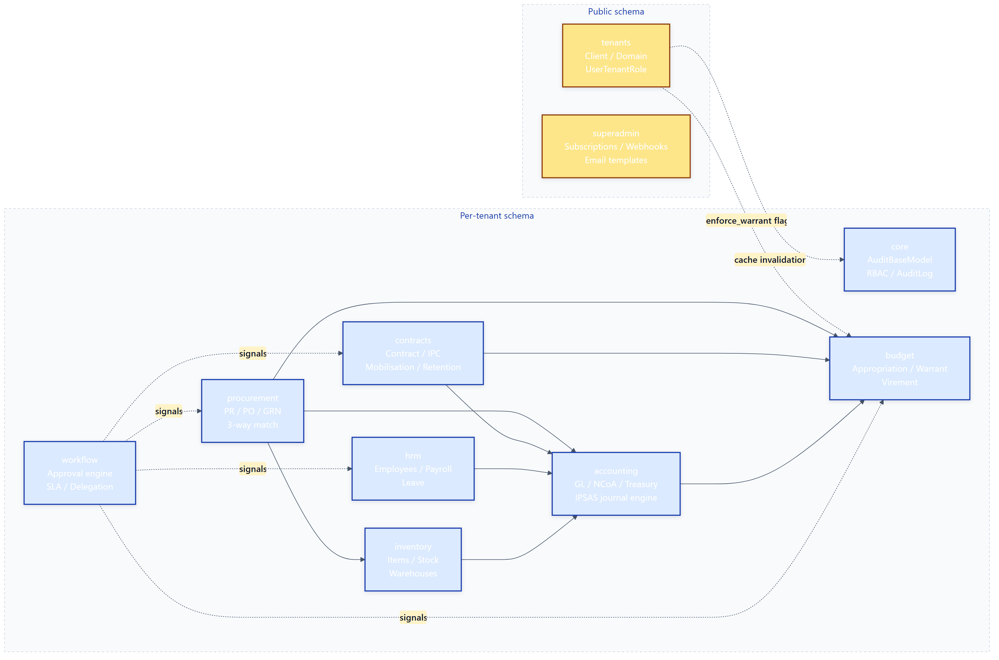

**Key architectural facts:**
- `tenants` and `superadmin` live in the **public** schema. Everything else
  is per-tenant (one PostgreSQL schema per state government / MDA).
- `core` is the leaf dependency — every domain module inherits
  `AuditBaseModel` / `StatusTransitionMixin` / `ImmutableModelMixin`
  from it. Core has no domain logic.
- `accounting` is the GL hub. Procurement, Contracts, HRM, Inventory all
  ultimately call `IPSASJournalService.post_journal()` to land their
  effects in the ledger.
- `budget` is the spending gate. Every `JournalHeader → Posted` triggers
  `accounting.signals.budget_enforcement` which calls into
  `budget.services` for STRICT / WARNING / NONE policy decisions.
- `workflow` is a generic multi-step approval engine that any document
  in any module can opt into via a Generic Foreign Key.

---

## 2. Cross-module integration map

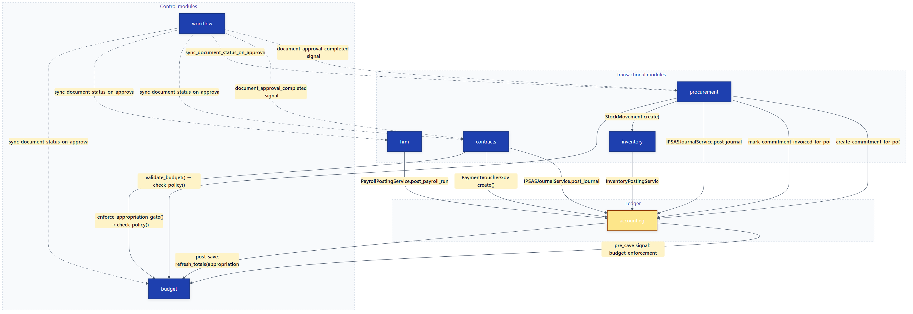

**Integration patterns used:**

| Pattern | Where | Purpose |
|---|---|---|
| **Direct service call** | `IPCService → IPSASJournalService.post_journal()` | Synchronous, atomic GL posting |
| **Django signal** | `JournalHeader.pre_save → check_policy()` | Cross-cutting budget enforcement |
| **Custom Signal** | `workflow.signals.document_approval_completed` | Decoupled post-approval auto-actions |
| **Generic FK** | `workflow.Approval.content_type / object_id` | One approval engine for any document |
| **Helper service** | `inventory.services.get_default_warehouse_for_mda()` | Cross-module lookup without circular import |

---

## 3. Tenants module

**Purpose:** Multi-tenant bootstrap. Each Nigerian state government (or MDA)
gets its own PostgreSQL schema. `Client` rows in the public schema describe
each tenant; `django-tenants` middleware routes requests to the right schema.

### Key models

| Model | File:Line | Role |
|---|---|---|
| `Client` | `tenants/models.py:61` | Tenant root — schema name, branding, feature flags |
| `Domain` | `tenants/models.py:257` | Hostnames mapping to `Client` |
| `TenantModule` | `tenants/models.py:278` | Per-tenant feature toggles (HR, contracts, etc.) |
| `TenantSubscription` | `tenants/models.py:378` | Plan / billing lifecycle |
| `UserTenantRole` | `tenants/models.py:408` | User ↔ tenant ↔ role mapping |
| `SubscriptionPlan` | `tenants/models.py:307` | Pricing tier definitions |

### Process flow

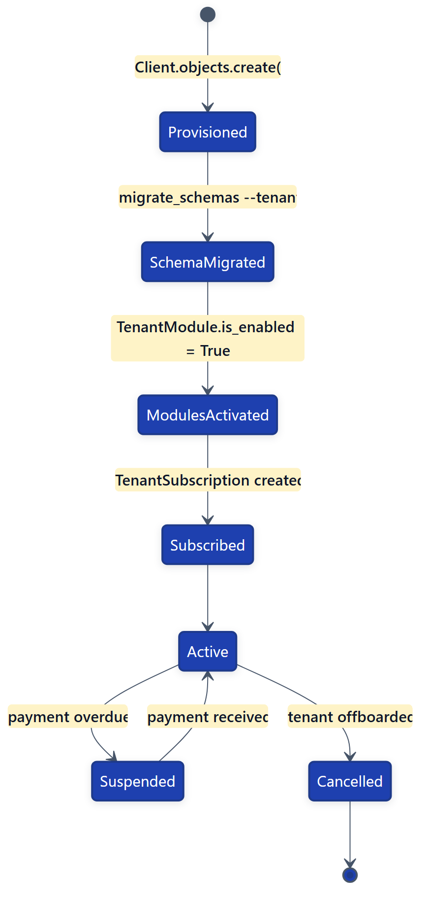

### Integration points

- **Out:** `UserTenantRole` save/delete fires `core.permissions.invalidate_permission_cache()` and `core.cache_utils.invalidate_access_cache()`.
- **Out:** `TenantSubscription` save fires `core.cache_utils.invalidate_subscription_cache()`.
- **In:** `budget.services._is_warrant_enforced()` reads `connection.tenant.enforce_warrant` at posting time.
- **In:** Every request: `django-tenants` middleware sets `connection.tenant` from the hostname; all per-tenant ORM operations rely on this.

---

## 4. Core module

**Purpose:** Pure infrastructure — base model mixins, RBAC, audit log, MFA,
session management, and cross-cutting utilities. **No domain business logic.**

### Key abstractions

| Abstraction | File:Line | Role |
|---|---|---|
| `AuditBaseModel` | `core/models.py:26` | `created_at` / `updated_at` / `created_by` / `updated_by` on every domain model |
| `StatusTransitionMixin` | `core/models.py:86` | Declarative `ALLOWED_TRANSITIONS` dict; gate at `save()` |
| `ImmutableModelMixin` | `core/models.py:48` | Block field edits once a record is `Posted` / `Approved` |
| `AuditLog` | `core/models.py:118` | Append-only audit trail (who-did-what-when) |
| `Role` / `RoleAssignment` | `core/models.py:476 / 610` | RBAC primitives — used by every module's permissions |
| `Organization` | `core/models.py:929` | Optional org structure for non-government tenants |

### Process flow

Core has no state machine of its own — it provides building blocks. The
*pattern* every domain module follows:

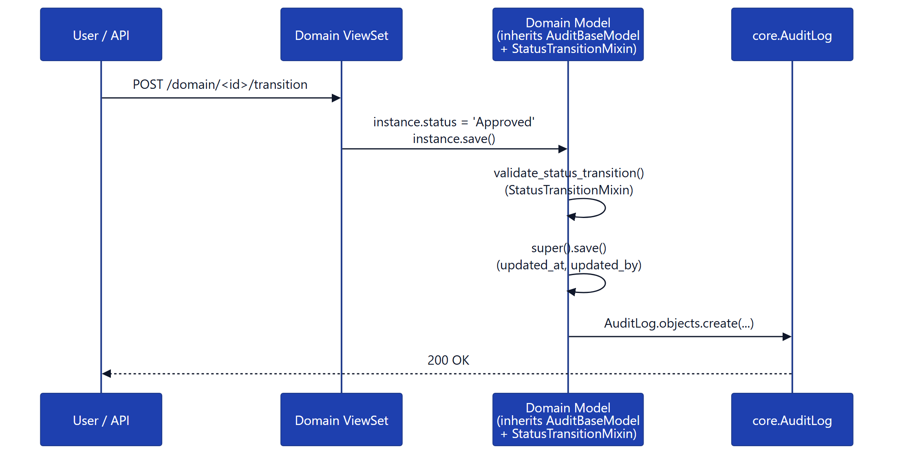

### Integration points

- **Out:** None — leaf dependency.
- **In:** Every domain module imports from `core`. `accounting`, `procurement`,
  `budget`, `contracts`, `hrm`, `inventory`, `workflow` all inherit
  `AuditBaseModel` / `StatusTransitionMixin` / `ImmutableModelMixin`.

---

## 5. Superadmin module

**Purpose:** Platform-operator (SaaS) layer. Manages tenants, subscriptions,
support tickets, email templates, webhooks, referral commissions, and
global announcements. Lives in the **public** schema.

### Key models

| Model | File:Line | Role |
|---|---|---|
| `SuperAdminProfile` | `superadmin/models.py:14` | Platform staff user profile |
| `ImpersonationLog` | `superadmin/models.py:144` | Audit trail when staff "log in as" tenant user |
| `Referral` / `Commission` | `superadmin/models.py:220 / 248` | Partner / referral payouts |
| `SupportTicket` | `superadmin/models.py:331` | Inbound support queue |
| `WebhookConfig` / `WebhookDelivery` | `superadmin/models.py:590 / 631` | Outbound webhook + retry tracking |
| `EmailTemplate` | `superadmin/models.py:79` | Multi-language editable templates |

### Process flow — typical operator workflow

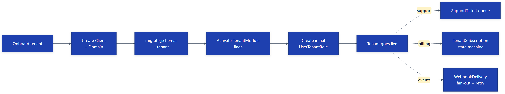

### Integration points

- Largely self-contained at the public schema. Reads `tenants.Client` for
  impersonation and subscription reporting.
- No inbound module dependencies (per-tenant modules don't reach into
  superadmin).

---

## 6. Budget module

**Purpose:** Nigerian IFMIS budget lifecycle — annual appropriation enacted by
the State House of Assembly, then released in tranches as Warrants (AIE —
Authority to Incur Expenditure). Enforces spending gates against the
Appropriation register.

### Key models

| Model | File:Line | Role |
|---|---|---|
| `UnifiedBudget` | `budget/models.py:29` | Logical budget container — wraps Appropriation, Revenue, Virement |
| `Appropriation` | `budget/models.py:660` | The legal spending authority for one (MDA × economic × fund × FY) tuple |
| `Warrant` | `budget/models.py:1223` | AIE — releases cash within `[effective_from, effective_to]` |
| `AppropriationVirement` | `budget/models.py:1521` | Reallocation between appropriation lines |
| `RevenueBudget` | `budget/models.py:1432` | Revenue targets (separate from expenditure budget) |
| `WarrantPrintoutSettings` | `budget/models.py` | Tenant-wide letterhead/signatures config for printed AIEs |

### Process flow — Appropriation

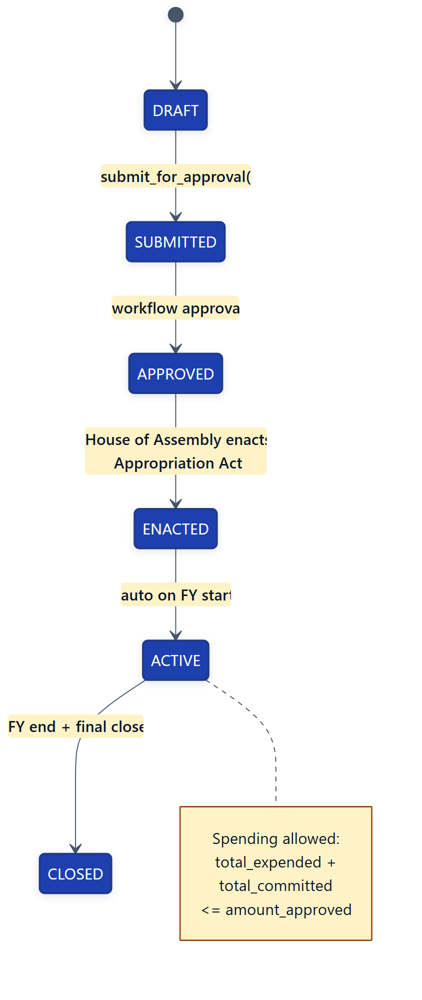

### Process flow — Warrant (AIE)

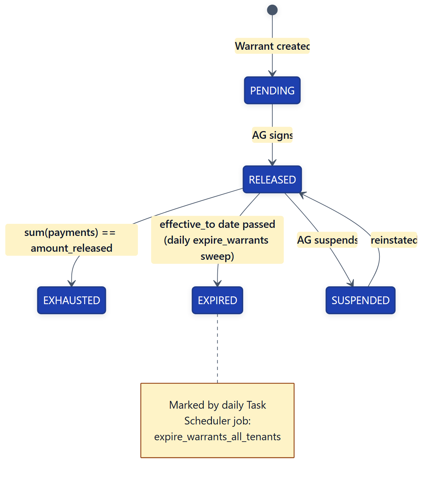

### Process flow — spend authorisation

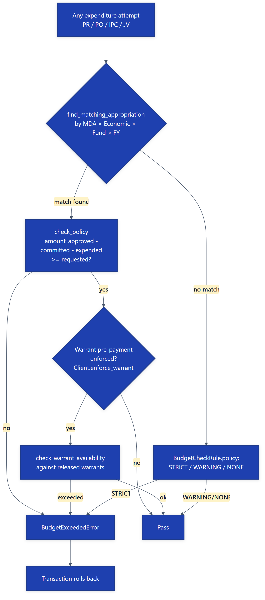

### Integration points

- **Out:** `budget.services.BudgetValidationService.validate_expenditure()` — called by accounting, procurement, contracts before any expenditure.
- **Out:** `_is_warrant_enforced()` reads `tenants.Client.enforce_warrant`.
- **In:** `accounting.signals.budget_enforcement.pre_save(JournalHeader)` calls `check_policy()` and `check_warrant_availability()`.
- **In:** `accounting.signals.budget_enforcement.post_save(JournalHeader)` calls `appropriation_totals.refresh_totals(appropriation)` to keep `cached_total_committed` / `cached_total_expended` fresh.
- **In:** `procurement.PurchaseRequest.validate_budget()` and `PurchaseOrder.process_budget_encumbrance()` call `accounting.services.budget_check_rules.check_policy()`.
- **In:** `contracts.IPCService._enforce_appropriation_gate()` calls `check_policy()` before posting the IPC accrual journal.

---

## 7. Accounting module

**Purpose:** Single source of truth for the General Ledger. Implements the
6-segment Nigerian Chart of Accounts (NCoA), IPSAS-accrual journal engine,
TSA / treasury cash management, fixed assets, payroll posting (delegated
target), tax / WHT, period close, and statutory reporting.

### Key models

| Model | File:Line | Role |
|---|---|---|
| `JournalHeader` / `JournalLine` | `accounting/models/gl.py:263` | The GL — DR=CR enforced |
| `Account` | `accounting/models/gl.py:128` | Chart of Accounts row |
| `NCoACode` | `accounting/models/ncoa.py:389` | 6-segment classification (admin, economic, functional, programme, fund, geo) |
| `PaymentVoucherGov` | `accounting/models/treasury.py:124` | Government payment voucher — primary cash-out document |
| `TreasuryAccount` | `accounting/models/treasury.py:16` | TSA hierarchy (Main, Sub-Account, Zero-Balance) |
| `PaymentInstruction` | `accounting/models/treasury.py:308` | Bank-bound instruction (NIBSS / RTGS) |
| `BudgetCheckRule` | `accounting/models/...` | Per-account policy: STRICT / WARNING / NONE |

### Process flow — Journal Header

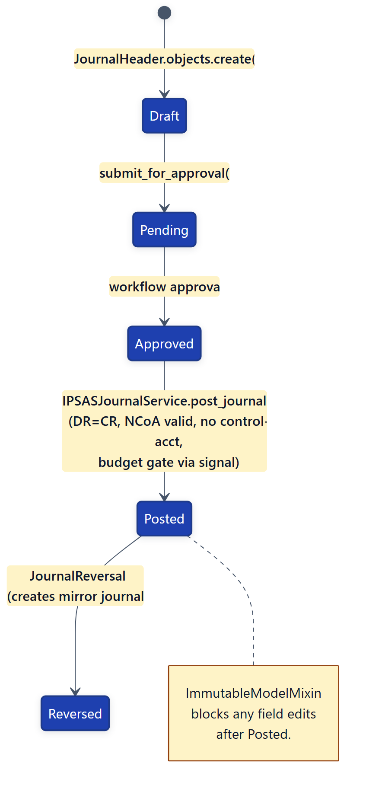

### Process flow — Payment Voucher (PV)

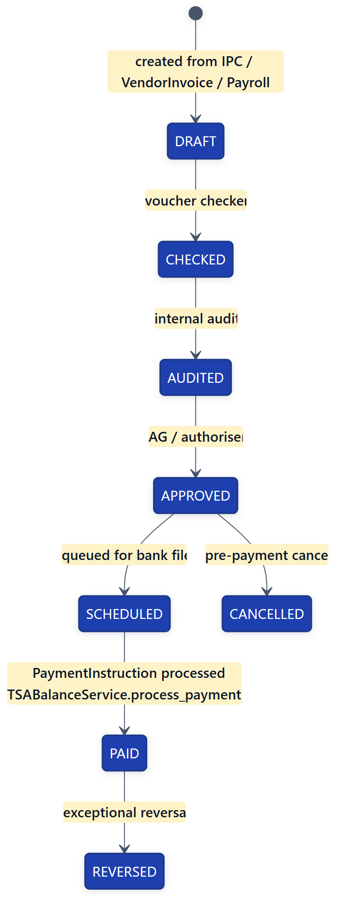

### Process flow — IPSAS journal posting

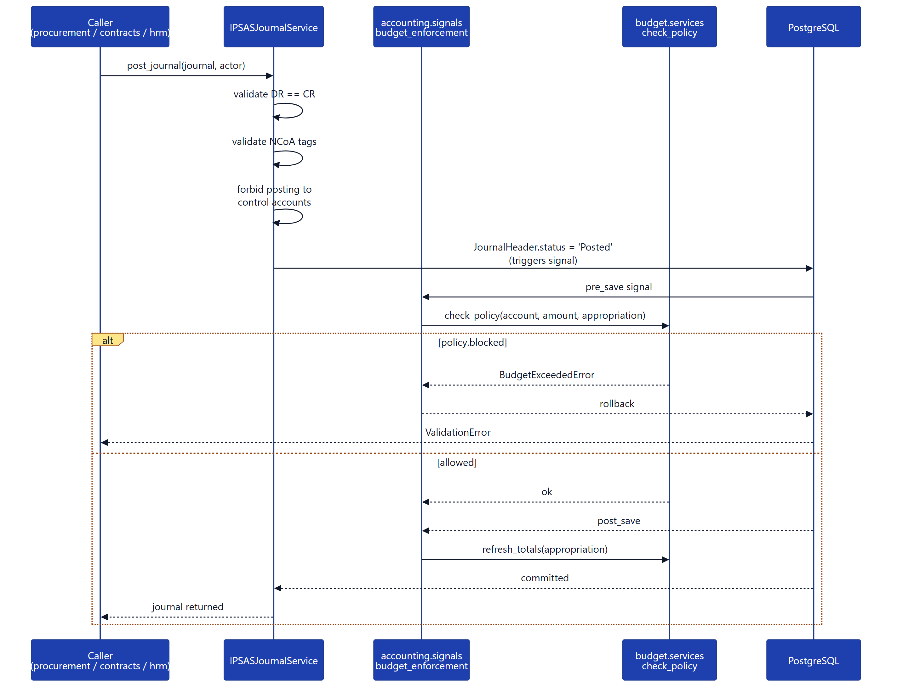

### Integration points

- **Out:** `accounting/signals/budget_enforcement.py` → `budget.models.Appropriation` (refresh totals).
- **Out:** `accounting/signals/coa_to_ncoa.py` on `Account` save → upserts `NCoACode / EconomicSegment` (internal CoA ↔ NCoA mirror).
- **In (procurement):** `ProcurementPostingService`, `create_commitment_for_po()`, `mark_commitment_invoiced_for_po()`, `_post_matching_to_gl_inner()`.
- **In (contracts):** `IPSASJournalService.post_journal()` from `IPCService.approve()`, `PaymentVoucherGov.objects.create()` from `IPCService.create_draft_voucher()`.
- **In (hrm):** `PayrollPostingService.post_payroll_run()` from `PayrollRun.save()` on Approved.
- **In (inventory):** `InventoryPostingService` on `StockMovement` create.

---

## 8. Procurement module

**Purpose:** Procurement-to-payment (P2P) cycle. Vendor registry, purchase
requests, purchase orders with budget commitment, goods received notes,
3-way invoice match, and vendor performance.

### Key models

| Model | File:Line | Role |
|---|---|---|
| `Vendor` | `procurement/models.py:77` | Supplier master (with KYC, bank, tax IDs) |
| `PurchaseRequest` | `procurement/models.py:244` | Internal request — pre-PO |
| `PurchaseOrder` | `procurement/models.py:448` | Authorised order to vendor — budget commitment |
| `GoodsReceivedNote` | `procurement/models.py:926` | Receipt confirmation — feeds inventory |
| `InvoiceMatching` | `procurement/models.py:1431` | 3-way match: PO ↔ GRN ↔ Vendor Invoice |
| `ProcurementBudgetLink` | (in accounting models) | Per-PO encumbrance row in Appropriation register |

### Process flow — full P2P cycle

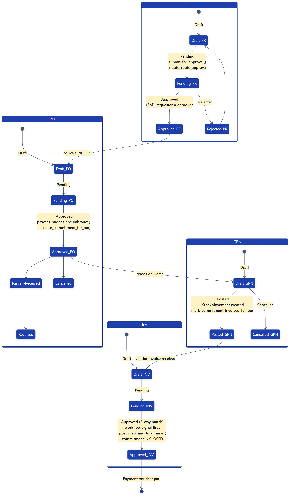

### Process flow — sequence (PR → Payment)

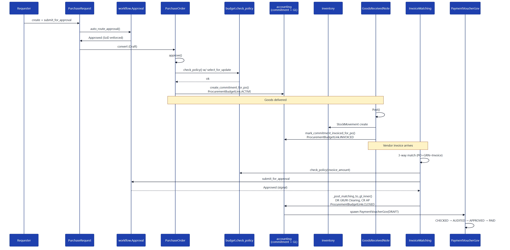

### Integration points

- **Out (accounting):** `create_commitment_for_po()`, `mark_commitment_invoiced_for_po()`, `cancel_commitment_for_po()`, `IPSASJournalService.post_journal()`, `ProcurementPostingService`.
- **Out (inventory):** `StockMovement` created inline in `GoodsReceivedNote.save()`; `inventory.services.get_default_warehouse_for_mda()` resolves MDA → Warehouse.
- **Out (budget):** `PurchaseRequest.validate_budget()` and `PurchaseOrder.process_budget_encumbrance()` call `accounting.services.budget_check_rules.check_policy()`.
- **In (workflow):** `workflow.signals.document_approval_completed` → `procurement.signals.auto_post_invoicematching_on_approval`.

---

## 9. Contracts module

**Purpose:** Capital / infrastructure contract management — activation,
milestones, measurement books, Interim Payment Certificates (IPCs) with
**ten** structural overpayment-prevention controls, mobilisation advances,
retention holdback, and variations / write-ups.

### Key models

| Model | File:Line | Role |
|---|---|---|
| `Contract` | `contracts/models/contract.py:78` | Aggregate root — vendor, NCoA, fiscal year, ceiling |
| `ContractBalance` | `contracts/models/contract.py:324` | Real-time spending ledger (locked per IPC) |
| `ContractYearPlan` | `contracts/models/year_plan.py` | Multi-year split — one row per fiscal year |
| `MilestoneSchedule` | `contracts/models/contract.py:465` | Deliverables + payment triggers |
| `MeasurementBook` | `contracts/models/payment.py:42` | On-site quantity record |
| `InterimPaymentCertificate` | `contracts/models/payment.py:161` | Periodic payment certificate |
| `MobilizationPayment` | `contracts/models/payment.py:414` | Up-front advance |
| `RetentionRelease` | `contracts/models/payment.py:470` | Practical / final retention release |
| `Variation` | `contracts/models/variation.py` | "Write-up" — upward contract revision |

### Process flow — Contract lifecycle

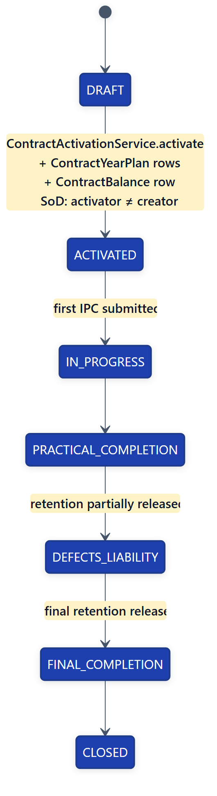

### Process flow — IPC lifecycle (the 10-control engine)

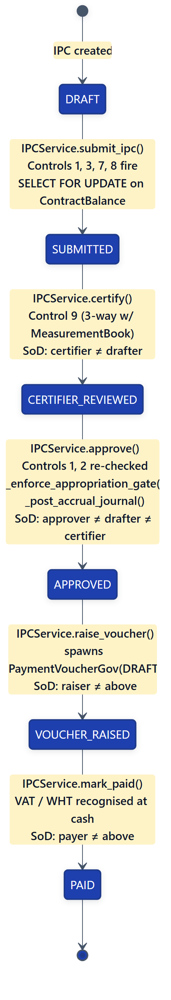

**Ten structural controls (enforced by `IPCService`):**
1. Ceiling — certified + pending ≤ contract_ceiling
2. Coherence — net_payable recomputed and reconciled
3. Monotonicity — cumulative work-done never decreases
4. Mobilization recovery — delegated to `MobilizationService`
5. Retention cap — delegated to `RetentionService`
6. Variation approval — only APPROVED variations count
7. Duplicate IPC — `integrity_hash` uniqueness (DB partial index)
8. Fiscal-year boundary — `posting_date` inside `year_plan.fiscal_year`
9. Three-way match — IPC ↔ MeasurementBook ↔ PaymentVoucher
10. Segregation of Duties — submitter ≠ certifier ≠ approver ≠ voucher-raiser ≠ payer

### Process flow — IPC approval sequence

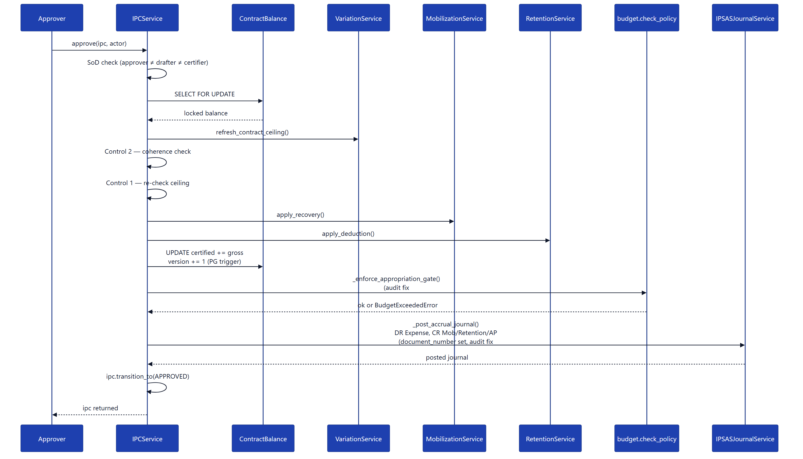

### Integration points

- **Out (accounting):** `IPSASJournalService.post_journal()` (IPC approval), `PaymentVoucherGov.objects.create()` (voucher raise), `accounting.services.procurement_posting.get_vendor_ap_account()`.
- **Out (budget):** `IPCService._enforce_appropriation_gate()` calls `find_matching_appropriation()` + `check_policy()` against the IPSAS Appropriation register before the accrual journal is created.
- **Out (workflow):** `Variation` and `IPC` approval steps optionally route via `workflow.Approval`.
- **In (workflow):** `workflow.signals.sync_document_status_on_approval` writes back into `ContractApprovalStep.status`.

---

## 10. Inventory module

**Purpose:** Item / stock master, warehouse stock ledger, reservations,
batch / serial tracking, reorder alerts, inter-warehouse transfers.

### Key models

| Model | File:Line | Role |
|---|---|---|
| `Item` | `inventory/models.py:11` | Item master — SKU, unit, GL accounts |
| `ItemStock` | `inventory/models.py:264` | Per-warehouse quantity + reserved snapshot |
| `StockMovement` | `inventory/models.py:503` | Atomic IN / OUT / ADJ / TRF event |
| `ItemBatch` | `inventory/models.py:207` | Batch / lot tracking with expiry |
| `Warehouse` | `inventory/models.py:675` | Physical / virtual location |
| `Reservation` | `inventory/models.py:766` | Soft-allocation against a future need |

### Process flow — stock movement

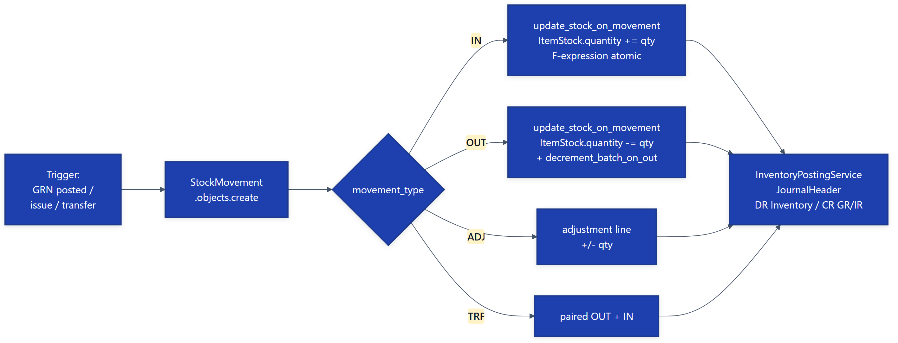

### Process flow — reservation

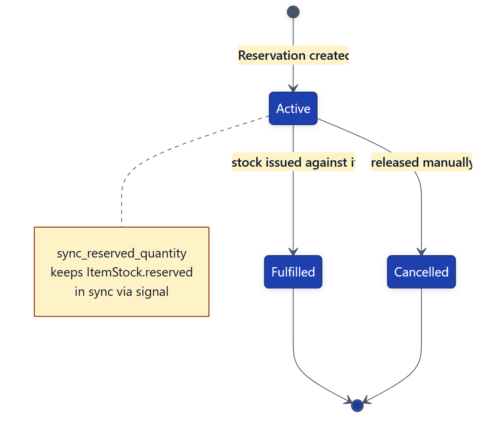

### Integration points

- **Out (accounting):** `InventoryPostingService` creates `JournalHeader` / `JournalLine` for stock movements (capitalised inventory accounting).
- **In (procurement):** `GoodsReceivedNote.save()` creates `StockMovement` rows inline; calls `inventory.services.get_default_warehouse_for_mda()`.

---

## 11. HRM module

**Purpose:** Employee master, leave / attendance, recruitment pipeline,
payroll runs with salary structures and Nigerian statutory deductions
(PAYE, pension, NHF, NSITF).

### Key models

| Model | File:Line | Role |
|---|---|---|
| `Employee` | `hrm/models.py:56` | Staff master — grade, MDA, bank, tax IDs |
| `SalaryStructure` | `hrm/models.py:460` | Grade × component matrix |
| `PayrollPeriod` | `hrm/models.py:544` | Monthly payroll cycle row |
| `PayrollRun` | `hrm/models.py:573` | One run = one MDA × one period |
| `PayrollLine` | `hrm/models.py:632` | Per-employee gross / deductions / net |
| `LeaveRequest` | `hrm/models.py:171` | Leave application + balance tracking |

### Process flow — Payroll Run

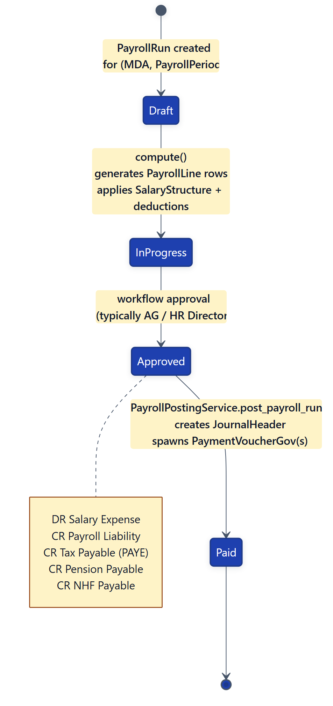

### Process flow — Leave Request

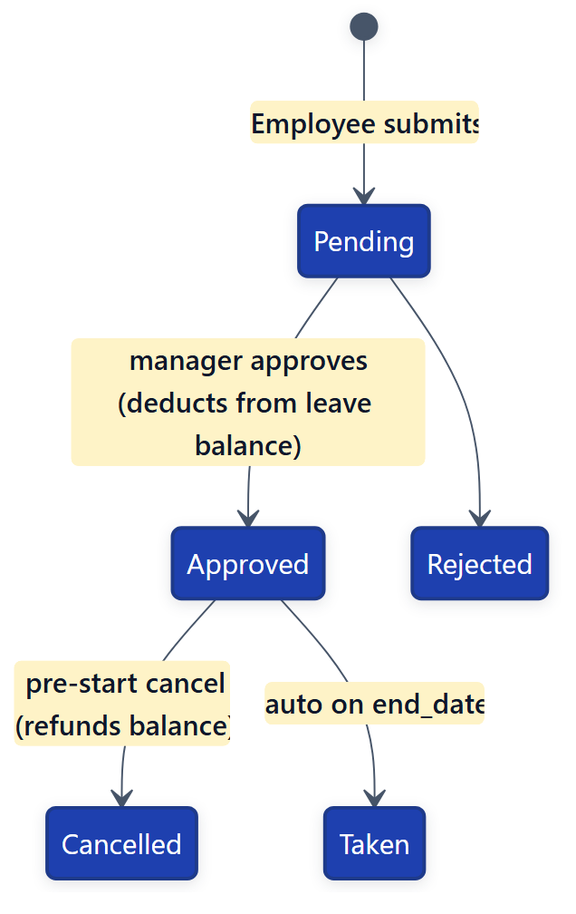

### Integration points

- **Out (accounting):** `PayrollPostingService.post_payroll_run()` creates `JournalHeader`; `PayrollRun.payroll_expense_account` is a FK to `accounting.Account`; `PayrollRun.journal_entry` FK is set on completion.
- **In:** None — no other module calls into HRM.

---

## 12. Workflow module

**Purpose:** Generic multi-step approval engine. Any document in any module
can attach an `Approval` (via `ContentType` GFK) with one or more
`ApprovalStep`s, SLA tracking, and delegation.

### Key models

| Model | File:Line | Role |
|---|---|---|
| `Approval` | `workflow/models.py:162` | The approval instance, points at any document |
| `ApprovalStep` | `workflow/models.py:218` | One reviewer's step |
| `ApprovalTemplate` | `workflow/models.py:116` | Named template (e.g. "PO ≥ ₦10M") |
| `ApprovalTemplateStep` | `workflow/models.py:148` | Template step definition (tier, role, threshold) |
| `ApprovalDelegation` | `workflow/models.py:340` | "While I'm on leave, route to X" |
| `ApprovalSLAViolation` | `workflow/models.py:298` | SLA breach record for reporting |

### Process flow — generic approval

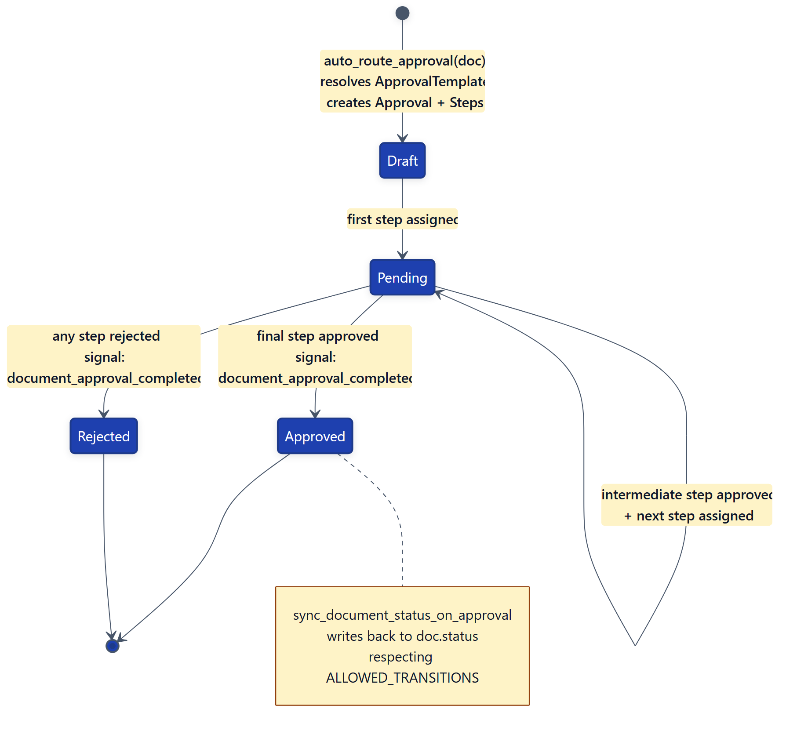

### Process flow — multi-tier approval (example: PO ≥ ₦10M)

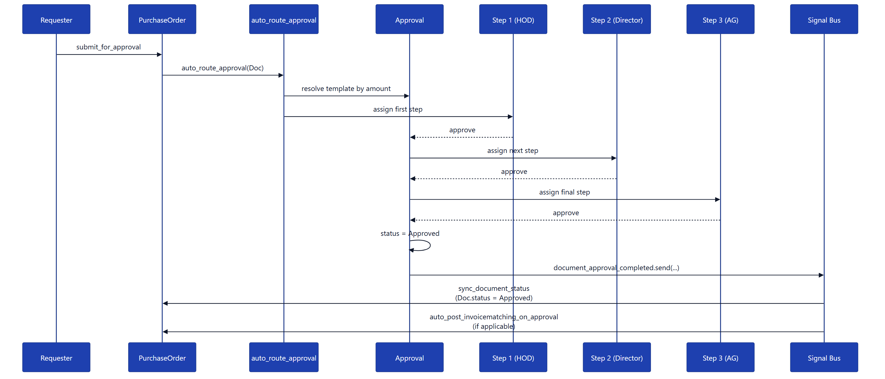

### Integration points

- **Out:** Custom Django Signal `document_approval_completed` (consumed by `procurement.signals.auto_post_invoicematching_on_approval`).
- **Out:** `sync_document_status_on_approval` writes back to any document with a `status` field across all modules.
- **In:** Every module that wants workflow-gated approval calls `auto_route_approval(document, ...)` from its `submit_for_approval` action — `procurement`, `contracts`, `budget`, `hrm` all use this.

---

## 13. End-to-end canonical flows

### 13.1 Procurement-to-Payment (P2P) — full flow

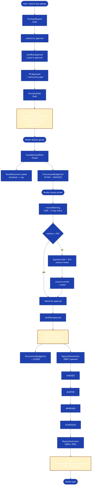

### 13.2 Contract-to-Payment (C2P) — full flow

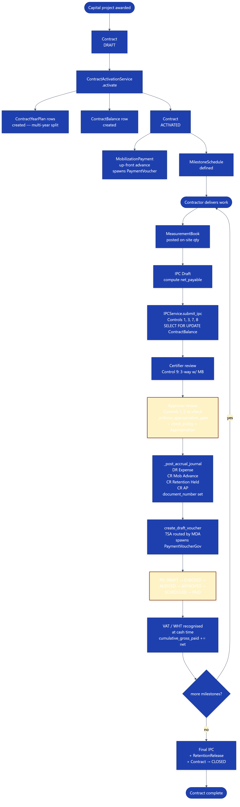

### 13.3 Budget enactment → Spend gate

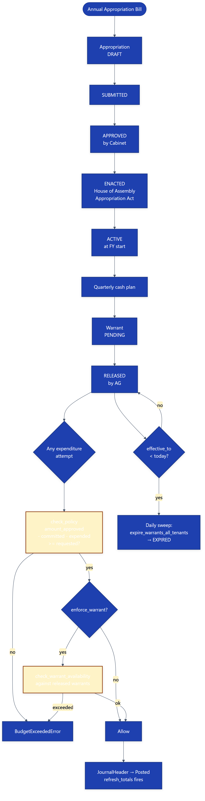

### 13.4 Payroll → GL → Treasury

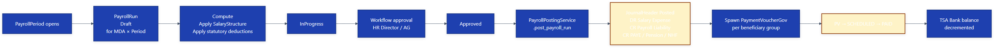

---

## Appendix A — Files map (where to look)

| Concern | Primary location |
|---|---|
| GL posting engine | `accounting/services/ipsas_journal_service.py` |
| Budget policy resolver | `accounting/services/budget_check_rules.py` |
| Budget enforcement signal | `accounting/signals/budget_enforcement.py` |
| Procurement commitments | `accounting/services/procurement_commitments.py` |
| Contract IPC engine | `contracts/services/ipc_service.py` |
| Contract activation | `contracts/services/contract_activation.py` |
| Mobilisation / retention | `contracts/services/mobilization_service.py`, `retention_service.py` |
| Workflow auto-routing | `workflow/views.py: auto_route_approval()` |
| Workflow signals | `workflow/signals.py` |
| TSA cash service | `accounting/services/tsa_balance_service.py` |
| Payroll posting | `accounting/services/payroll_posting.py` |
| Inventory posting | `accounting/services/inventory_posting.py` |
| Tenant-scope routing | `tenants/middleware.py` (django-tenants) |
| Daily warrant expiry | `budget/management/commands/expire_warrants_all_tenants.py` |

## Appendix B — Status palette (UI reference)

| Status | Hex | Used by |
|---|---|---|
| DRAFT / Pending | `#f59e0b` (amber) | All modules |
| APPROVED / RELEASED / POSTED | `#22c55e` (green) | All modules |
| REJECTED / FAILED / CANCELLED | `#ef4444` (red) | All modules |
| EXPIRED / SUSPENDED | `#b45309` (rust) | budget.Warrant |
| EXHAUSTED | `#64748b` (slate) | budget.Warrant |
| Posted (immutable) | `#166534` (deep green) | accounting.JournalHeader |
| PAID | `#16a34a` (emerald) | accounting.PaymentVoucherGov |

---

*End of document.*
