# Responsive Design Plan — Quot PSE

**Goal:** make every page usable on every screen size from 320 px (small Android phone) to 2560 px (QHD desktop) — **without rewriting existing component internals or breaking any current flow.**

**Non-goals:** a visual redesign. The navy/green identity, typography choices, and information architecture stay exactly as they are. This plan is about *adapting* that identity to small viewports.

---

## 1. Assessment of current state

### 1.1 What we have today

| Area | Current behavior | Mobile grade |
|---|---|---|
| Landing page | Two-column hero collapses naturally below ~700 px; grids already `auto-fit/minmax` | 🟢 Mostly OK — nav wraps awkwardly |
| Brochure / Training guide | Explicit `@media (max-width:900px)` collapse | 🟢 Already responsive |
| Tenant sidebar | Fixed 280 px left sidebar, always visible | 🔴 Eats 60% of a 480 px screen |
| Dashboard KPI cards | Flexbox row, no wrap hints | 🟡 Overflows horizontally at < 600 px |
| Data tables (Appropriations, Journals…) | Native `<table>` with 6–9 columns | 🔴 Right half cut off on phones |
| Forms (Appropriation, PR, PO…) | CSS grid `grid-template-columns: 1fr 1fr 1fr` | 🔴 Inputs become ~90 px wide on phones |
| Approval drawer | Fixed right-side drawer 520 px wide | 🔴 Drawer wider than phone screen |
| IPSAS reports | HTML tables with sticky headers | 🟡 Scrolls but loses column context |
| Notification bell dropdown | 340 px right-aligned | 🟡 Overlaps off-screen on small phones |
| Charts (Recharts) | Fixed widths set in pixels | 🔴 Don't resize with container |
| Modals | Centered, 600 px fixed | 🔴 Overflow viewport on phones |

### 1.2 Root causes

1. **Heavy reliance on inline `style={{...}}`** — media queries are impossible inside a style object, so current code hard-codes pixel values.
2. **Fixed widths instead of fluid/max-width pairs** — `width: 280` rather than `width: 'min(280px, 80vw)'`.
3. **Grid templates with fixed column counts** — `1fr 1fr 1fr` doesn't know about viewport.
4. **No shared breakpoint hook** — each component invents its own (or more commonly, doesn't bother).
5. **No viewport meta verification on every page** — most pages have it, but we've never audited.

### 1.3 Constraints we must respect

- **No breaking changes.** Every existing flow (create appropriation, post journal, approve PO) must keep working exactly as today.
- **No visual redesign.** Colors, fonts, and module layouts stay identical on desktop.
- **Incremental shipping.** Each phase must merge and deploy independently.
- **Progressive enhancement.** Pages that aren't yet optimized should still *function* on mobile (just scroll horizontally) — only the polish is incremental.

---

## 2. Success criteria

| Metric | Target |
|---|---|
| Every sidebar route renders without horizontal overflow at 360 × 640 | 100% of pages |
| Primary actions reachable with thumb on 5"–6" phone | Bottom-half placement or sticky bar |
| Touch targets (buttons, row clicks) | ≥ 44 × 44 px |
| Form inputs don't trigger iOS auto-zoom | font-size ≥ 16 px on all `<input>` |
| Data-table columns remain legible | Horizontal scroll with column-one pinning, or card-list fallback |
| No keyboard-obscured submit buttons | Visible above the keyboard on iOS/Android |
| Lighthouse Mobile score | ≥ 85 on Dashboard, Appropriations list, Journals list, IPSAS SoFP |
| Core Web Vitals (p75 mobile) | LCP < 2.5 s · INP < 200 ms · CLS < 0.1 |

---

## 3. Breakpoint system

A single, named set of breakpoints everyone uses. Mobile-first (min-width).

```ts
// frontend/src/design/breakpoints.ts
export const BP = {
  xs: 0,      // phones, default
  sm: 480,    // large phones in landscape
  md: 768,    // tablets portrait
  lg: 1024,   // tablets landscape / small laptop
  xl: 1280,   // desktop
  xxl: 1536,  // wide desktop
} as const;

export type Breakpoint = keyof typeof BP;
```

A **design-token system** layered on top so spacing and typography adapt:

```ts
// frontend/src/design/tokens.ts
export const space = (bp: Breakpoint) => ({
  page:   bp === 'xs' ? 16 : bp === 'md' ? 24 : 40,
  card:   bp === 'xs' ? 16 : 24,
  gutter: bp === 'xs' ? 12 : 16,
});

export const type = (bp: Breakpoint) => ({
  h1: bp === 'xs' ? '24px' : '32px',
  h2: bp === 'xs' ? '20px' : '24px',
  body: '15px',  // never < 16 for inputs (iOS zoom)
});
```

---

## 4. The core infrastructure (Phase 0 — prerequisite)

This phase lands **before** any per-page work. Nothing else in the plan can start without it.

### 4.1 `useBreakpoint()` hook — 1 file, ~40 lines

```ts
// frontend/src/design/useBreakpoint.ts
import { useEffect, useState } from 'react';
import { BP, Breakpoint } from './breakpoints';

function resolveBp(w: number): Breakpoint {
  if (w >= BP.xxl) return 'xxl';
  if (w >= BP.xl)  return 'xl';
  if (w >= BP.lg)  return 'lg';
  if (w >= BP.md)  return 'md';
  if (w >= BP.sm)  return 'sm';
  return 'xs';
}

export function useBreakpoint(): Breakpoint {
  const [bp, setBp] = useState<Breakpoint>(() =>
    resolveBp(typeof window !== 'undefined' ? window.innerWidth : 1280)
  );
  useEffect(() => {
    const on = () => setBp(resolveBp(window.innerWidth));
    window.addEventListener('resize', on, { passive: true });
    return () => window.removeEventListener('resize', on);
  }, []);
  return bp;
}

export const useIsMobile = () => {
  const bp = useBreakpoint();
  return bp === 'xs' || bp === 'sm';
};
```

**How components use it** — no rewrite needed, just a conditional style value:

```tsx
const bp = useBreakpoint();
const isMobile = bp === 'xs' || bp === 'sm';
<div style={{
  padding: isMobile ? 16 : 40,
  gridTemplateColumns: isMobile ? '1fr' : '1fr 1fr 1fr',
}}>
```

### 4.2 Global responsive utility CSS — 1 file, `frontend/src/styles/responsive.css`

For things that *should* be className-driven (like hiding elements on certain sizes), ship a small utility layer. Loaded once in `main.tsx`.

```css
/* Mobile-first; add more as you need them, never remove. */
.hide-mobile  { display: block }
.hide-desktop { display: none }
.stack-mobile { display: block }
.tap-target   { min-width: 44px; min-height: 44px }

@media (max-width: 767px) {
  .hide-mobile  { display: none }
  .hide-desktop { display: block }
  .stack-mobile > * + * { margin-top: 12px }
  .stack-mobile { flex-direction: column !important }
}

/* iOS auto-zoom fix — inputs must be >= 16px on mobile */
@media (max-width: 767px) {
  input, textarea, select { font-size: 16px !important }
}

/* Horizontal scroll containers with a subtle gradient fade */
.scroll-x { overflow-x: auto; -webkit-overflow-scrolling: touch }
.scroll-x::-webkit-scrollbar { height: 6px }
.scroll-x::-webkit-scrollbar-thumb { background: rgba(26,35,126,0.25); border-radius: 3px }
```

### 4.3 Viewport meta audit — 1 file edit

Confirm `index.html` has:

```html
<meta name="viewport" content="width=device-width, initial-scale=1, viewport-fit=cover" />
```

### 4.4 Acceptance criteria for Phase 0

- [ ] `useBreakpoint()` hook exported from `src/design/`
- [ ] `responsive.css` imported globally
- [ ] Viewport meta confirmed in `index.html`
- [ ] Zero existing component touched in this phase
- [ ] Build passes, zero test regression

**Effort:** ~0.5 day. **Risk:** 🟢 minimal (additive only).

---

## 5. The 9 implementation phases

Each phase: `Prereqs → Work → Acceptance → Effort → Risk`.

### Phase 1 — App shell (sidebar → drawer on mobile)

> **Most critical phase.** A collapsible sidebar unblocks every other page.

**Prereqs:** Phase 0.

**Work:**
- In `Sidebar.tsx`, render a fixed hamburger button top-left when `isMobile`.
- Sidebar slides in as an overlay (`position: fixed; transform: translateX(-100%)` → `0`).
- Click-outside + ESC key + Route-change all close the drawer.
- Header on mobile shows: `[☰] [Back] [Page title] [🔔]`.
- Desktop behavior unchanged.

**Acceptance:**
- At 360 px viewport, sidebar is hidden by default; tapping ☰ slides it in at 280 px width.
- Navigating to a new route auto-closes the drawer.
- Every existing desktop keyboard shortcut still works.

**Effort:** 1 day. **Risk:** 🟡 medium (touches the most shared component).

### Phase 2 — KPI cards & dashboard

**Prereqs:** Phase 1.

**Work:**
- Dashboard's KPI row: change from flex to `grid-template-columns: repeat(auto-fit, minmax(160px, 1fr))` so 4 cards on desktop → 2×2 on tablets → stacked on phones.
- Charts: wrap each Recharts container in `<ResponsiveContainer width="100%" height={isMobile ? 220 : 320}>`.
- Quick-actions row: horizontal scroll on mobile with snap-points.

**Acceptance:** Dashboard at 360 × 640 has no horizontal overflow; all KPI cards readable; charts fit viewport.

**Effort:** 1 day. **Risk:** 🟢 low.

### Phase 3 — Data tables (the hard one)

**Prereqs:** Phase 1.

**Work:** introduce `<ResponsiveTable>` wrapper component with two modes:

- **Desktop mode** — native table with column pinning.
- **Mobile mode** — each row renders as a card with primary cols stacked, secondary cols in a collapsed "More" section.

Configuration per table:

```tsx
<ResponsiveTable
  data={appropriations}
  primary={['fiscalYear', 'mda', 'amount']}     // shown on mobile card
  secondary={['economicCode', 'fund', 'status']} // in "More" drawer
  keyField="id"
  onRowClick={openDetail}
/>
```

Apply to: Appropriations · Journals · POs · PRs · GRN · Invoices · Vendors · Employees · Payrolls · Bank accounts.

**Acceptance:** every list page shows a legible, tappable card list at 360 px without horizontal scroll.

**Effort:** 2 days (build once, apply everywhere). **Risk:** 🟡 medium — data-heavy pages need QA.

### Phase 4 — Forms

**Prereqs:** Phase 0.

**Work:**
- Any `grid-template-columns: 1fr 1fr 1fr` changes to responsive: `repeat(auto-fit, minmax(240px, 1fr))`.
- Multi-line form rows with "Description" fields span full width via `grid-column: 1 / -1`.
- Submit/Cancel button bar becomes sticky at bottom on mobile with safe-area insets.
- All `<input type="number">` keep `inputMode="decimal"`, TIN / RC inputs use `inputMode="numeric"`.
- Dates: native `<input type="date">` on mobile (iOS wheel picker), custom picker on desktop.

**Touch pages:** Appropriation, Warrant, Journal (new + lines grid), PR, PO, GRN, Vendor Invoice, Employee, Payroll run, Bank Account, Settings tabs.

**Acceptance:** every form is usable on a 360 px phone; the keyboard doesn't obscure the submit button; no iOS zoom on focus.

**Effort:** 2 days. **Risk:** 🟡 medium — the Appropriation form has a nested lines grid that needs special care.

### Phase 5 — Drawers & modals

**Prereqs:** Phase 1.

**Work:**
- Right-side drawers (PR detail, PO detail, Approval drawer): on mobile become full-screen (`width: 100vw; height: 100vh`) with a header-based close button.
- Swipe-right-to-dismiss gesture via react-use-gesture.
- Centered modals: `max-width: min(600px, calc(100vw - 32px))`.
- Focus trap + `ESC` to close.
- Body scroll locked while open (`body { overflow: hidden }`).

**Acceptance:** tapping a row on mobile opens a full-screen drawer that can be dismissed by swipe-right or tapping X; keyboard nav works.

**Effort:** 1 day. **Risk:** 🟢 low.

### Phase 6 — Notification bell & top bar

**Prereqs:** Phase 1.

**Work:**
- On mobile, notification bell opens a **bottom sheet** (full-width, 70vh) rather than a dropdown.
- Notification list items grow to 56 px row height on mobile for tappability.
- Top bar on mobile consolidates: `[☰] [Title/Breadcrumb] [🔔] [Avatar]` with auto-elided breadcrumb.

**Acceptance:** bell is reachable and readable on a 360 px screen; 15-item list scrolls smoothly.

**Effort:** 0.5 day. **Risk:** 🟢 low.

### Phase 7 — IPSAS & dimensional reports

**Prereqs:** Phase 3 (ResponsiveTable must exist).

**Work:**
- Statement of Financial Position / Performance / Cash Flow / BvA all wrapped in `.scroll-x` with the row label column `position: sticky; left: 0`.
- Notes section: the inline data rows collapse into expandable `<details>` per note on mobile.
- Export menu on mobile: a bottom-sheet picker rather than a dropdown.

**Acceptance:** every IPSAS report is readable on mobile with label column pinned; export works; print-to-PDF unchanged on desktop.

**Effort:** 1 day. **Risk:** 🟡 medium — sticky-left-column CSS has historical cross-browser quirks.

### Phase 8 — Public-facing pages review

**Prereqs:** Phase 0.

**Work:**
- LandingPage: nav hamburger below 900 px; two-column sections already collapse via `auto-fit`. Audit each for minor tweaks.
- Brochure / Training guide: already responsive; audit only.
- Login / Register: audit input sizing and error-banner placement on mobile.

**Effort:** 0.5 day. **Risk:** 🟢 low.

### Phase 9 — Testing, visual regression, rollout

**Prereqs:** all prior phases.

**Work:**
- Add Playwright tests at breakpoints `[320, 375, 768, 1024, 1440]` for top 10 critical flows (login, dashboard, new appropriation, post journal, PR → PO, approval, IPSAS SoFP).
- Generate baseline screenshots; fail CI on > 0.1% pixel diff.
- Manual device QA: iPhone SE, iPhone 14, Samsung A-series, iPad Mini, iPad Pro, standard laptop 1366×768, 4K desktop.
- Run Lighthouse Mobile on the 4 key pages; target ≥ 85.

**Effort:** 2 days. **Risk:** 🟡 medium — setting up cross-browser device testing.

---

## 6. Timeline & sequencing

```mermaid
gantt
  dateFormat  X
  axisFormat  d%d
  section Foundation
  Phase 0 · Infrastructure         :p0, 0, 1
  section App shell
  Phase 1 · Sidebar / drawer       :p1, after p0, 1
  section Widgets
  Phase 2 · KPI cards + charts     :p2, after p1, 1
  Phase 3 · ResponsiveTable        :p3, after p1, 2
  Phase 4 · Forms                  :p4, after p0, 2
  Phase 5 · Drawers + modals       :p5, after p1, 1
  Phase 6 · Notifications + top bar:p6, after p1, 1
  section Long tail
  Phase 7 · IPSAS reports          :p7, after p3, 1
  Phase 8 · Public pages audit     :p8, after p0, 1
  Phase 9 · QA + rollout           :p9, after p7, 2
```



**Total effort:** ~11 working days (2 sprint-weeks) for a single frontend engineer. Parallelisable to ~7 days with two engineers (Phase 3 and Phase 4 don't overlap in files).

---

## 7. Risk register

| Risk | Likelihood | Impact | Mitigation |
|---|---|---|---|
| Sidebar rewrite breaks an existing module's navigation | Medium | High | Ship behind a feature flag for 1 sprint; A/B compare via telemetry. |
| ResponsiveTable doesn't fit every list (e.g. GRN has 12 cols) | Medium | Medium | Make `primary`/`secondary` prop-driven, keep horizontal scroll as a fallback. |
| Recharts doesn't honor % widths in some contexts | Low | Low | Wrap in `<ResponsiveContainer>`; measured during Phase 2. |
| iOS Safari `position: sticky` left-column glitches | Medium | Medium | Known quirk — use `transform: translateZ(0)` hack on the sticky cell. |
| Touch targets shrink under dense tables | Low | Low | `.tap-target` helper class + visual regression tests. |
| CLS regression from dynamic breakpoint decisions | Medium | Medium | Read viewport *synchronously* on first render; hydrate before paint. |
| `useBreakpoint` causes re-renders in expensive trees | Low | Medium | Memoize consumers; use `useSyncExternalStore` for concurrent-safe reads. |

---

## 8. Rollout plan

1. **Phase 0 ships alone** — it's additive and harmless.
2. Phases 1–6 each behind a feature flag `responsive_v1`, enabled for internal tenants first.
3. After 1 week of internal soak, enable for a pilot State tenant.
4. After 1 week of pilot with no P1 bugs, enable for all tenants.
5. Phase 7 (IPSAS) ships last because auditors are the most fussy users of those pages.
6. Phase 9 runs continuously from Phase 1 onwards.

---

## 9. What we explicitly do NOT do in v1

Documenting these so they come back as v2 work, not surprises:

- **Native apps.** No React Native / iOS / Android apps in v1. Web-only.
- **Offline mode.** Service worker / offline queue is out of scope.
- **Dark mode mobile tuning.** Dark mode exists globally; we only ensure it doesn't worsen on mobile, not that it's optimized.
- **Gesture-heavy interactions.** Pull-to-refresh, long-press menus — not in v1.
- **Different IA for mobile.** Sidebar stays the same tree; we don't build a mobile-specific "home" page.
- **Accessibility audit beyond WCAG 2.1 AA baselines.** A dedicated a11y pass is a separate project.

---

## 10. Definition of Done (for the whole initiative)

- [ ] Every sidebar route functional at 360 × 640, 768 × 1024, 1440 × 900
- [ ] Zero horizontal scrollbars on the body element below 1024 px
- [ ] All forms submittable on a 5.5" phone in portrait
- [ ] Lighthouse Mobile ≥ 85 on the 4 baseline pages
- [ ] Playwright responsive suite green across the 5 viewport profiles in CI
- [ ] Zero regression on desktop (visual + functional)
- [ ] `useBreakpoint` used by at least 15 components in the codebase
- [ ] Internal docs updated: `CONTRIBUTING.md` notes the `useBreakpoint` pattern
- [ ] Training guide + brochure confirmed still readable on mobile (they already are)

---

## 11. Appendix — component audit (the concrete list)

This is the shopping list. Each row = one file to touch in the phase noted.

| Component | File | Phase | Work |
|---|---|---|---|
| Sidebar | `components/Sidebar.tsx` | 1 | Mobile drawer + hamburger |
| Dashboard | `pages/gov/GovDashboard.tsx` | 2 | KPI grid + charts |
| Appropriation list | `pages/gov/AppropriationList.tsx` | 3 | ResponsiveTable |
| Appropriation form | `pages/gov/AppropriationForm.tsx` | 4 | Grid collapse |
| Journal list | `pages/accounting/JournalList.tsx` | 3 | ResponsiveTable |
| Journal form | `pages/accounting/JournalForm.tsx` | 4 | Grid + lines table |
| PR / PO / GRN / VI lists | `pages/procurement/*List.tsx` | 3 | ResponsiveTable |
| Approval inbox | `pages/workflow/ApprovalInbox.tsx` | 3 + 5 | Table + full-screen drawer |
| IPSAS reports (5) | `pages/gov/reports/*.tsx` | 7 | Sticky label + export |
| NotificationBell | `components/NotificationBell.tsx` | 6 | Mobile bottom sheet |
| Landing page | `pages/public/LandingPage.tsx` | 8 | Nav hamburger below 900px |
| Login / Register | `pages/Login.tsx`, `pages/Register.tsx` | 8 | Input audit |
| Settings pages (7) | `features/settings/*.tsx` | 4 | Form grid collapse |
| User management | `pages/UserManagement.tsx` | 3 + 4 | Table + form |

---

## 12. Metrics to watch after rollout

| Metric | Where | Target |
|---|---|---|
| Mobile session count | PostHog / analytics | Track week-on-week increase |
| Bounce rate on mobile login | PostHog | Should drop vs pre-rollout |
| P75 INP on Appropriations list | Core Web Vitals | < 200 ms |
| CLS on Dashboard | Core Web Vitals | < 0.1 |
| Form abandonment on mobile Appropriation form | PostHog funnel | < 20% |
| Error rate on approval actions from mobile | Sentry | No spike vs desktop |

---

**Owner:** Frontend engineering
**Review cadence:** end of each phase
**First review date:** on Phase 1 merge
